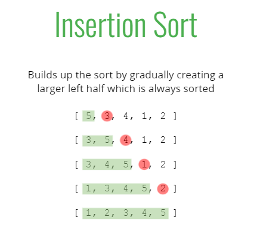

# Insertion Sort

> Time Complexity: O(n^2)

> Insertion Sort Pseudocode

1. Start by picking the second element in the array
2. Now compare the second element with the one before it and swap if necessary.
3. Continue to the next element and if it is in the incorrect order, iterate through the sorted portion (i.e. the left side) to place the element in the correct place.
4. Repeat until the array is sorted.